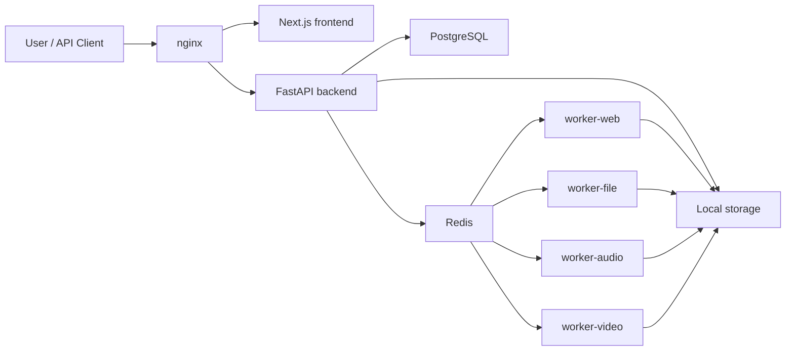

# MarkdownEverything

<p align="center">
  
</p>

<p align="center">
  <strong>Turn webpages, documents, text, audio, and video into clean, structured Markdown for AI systems and human knowledge bases.</strong>
</p>

<p align="center">
  <a href="#quick-start">Quick Start</a>
  · <a href="#what-it-converts">Converters</a>
  · <a href="#webpage-engine">Web Engine</a>
  · <a href="#api">API</a>
  · <a href="#roadmap">Roadmap</a>
</p>

<p align="center">
  
  
  
  
  
</p>

MarkdownEverything is an open-source content ingestion layer for the AI era. It is not a thin file-format converter. It fetches, cleans, structures, stores, and packages content as Markdown that is useful for people, AI summarization, RAG retrieval, agent tools, Obsidian-style archives, and future MCP integrations.

## Why It Exists

Most content is trapped in noisy places: webpages full of navigation, PDFs with brittle text extraction, DOCX files with embedded assets, long recordings, video pages, forum threads, and app-like public pages. MarkdownEverything turns those inputs into a predictable archive format:

- frontmatter with source metadata
- clean Markdown body
- downloaded assets
- timestamped audio/video transcripts
- result `.md` and `.zip`
- task metadata for debugging and automation

## What It Converts

| Input | Status | Notes |
| --- | --- | --- |
| Webpage URL | Working | SSRF-safe fetch, generic extraction, browser render fallback, snapshots for app/home/search pages |
| Plain text | Working | Unified Markdown output |
| HTML | Working | HTML to Markdown cleanup |
| CSV | Working | Markdown table output |
| PDF | Working | Text-first PDF extraction |
| DOCX | Working | Headings, paragraphs, tables, and image export |
| Audio files | Working | ASR provider abstraction, timestamped Markdown |
| Video files | Working | ffmpeg audio extraction, ASR timeline |
| Public video links | Working | yt-dlp for accessible public media only; no DRM/login/paywall bypass |

## Product Surface

- Home page with URL input, file upload, text/HTML entry, and supported-type overview
- Conversion task page with status, progress, errors, retry, and result navigation
- Result page with Markdown preview, source info, copy, `.md` download, `.zip` download, delete, and retry
- User history with type/status filters, search, delete, and redownload
- Admin dashboard with users, jobs, failed logs, workers, storage, and health checks

## Architecture



The Docker Compose stack includes:

- `frontend`: Next.js App Router + TypeScript
- `backend`: FastAPI + SQLAlchemy
- `worker-web`, `worker-file`, `worker-audio`, `worker-video`: Celery workers split by queue
- `postgres`: job/user/log metadata
- `redis`: Celery broker/result backend
- `nginx`: single entrypoint

## Quick Start

```powershell
cp .env.example .env
docker compose up --build
```

Open:

- App: <http://localhost>
- API docs: <http://localhost/api/docs>

The first registered user becomes an admin unless `BOOTSTRAP_ADMIN_EMAIL` and `BOOTSTRAP_ADMIN_PASSWORD` are provided.

For local development without Redis workers:

```powershell
cd backend
$env:SYNC_CONVERSIONS="true"
python -m uvicorn app.main:app --reload
```

## Configuration

Text, HTML, CSV, PDF, DOCX, and most webpage conversions work without API keys.

Audio/video transcription needs one ASR provider:

| Mode | Environment |
| --- | --- |
| Local Whisper | `ASR_PROVIDER=local_whisper`, optional `LOCAL_WHISPER_MODEL=base` |
| OpenAI-compatible ASR | `ASR_PROVIDER=cloud_openai_compatible`, `ASR_API_KEY`, optional `ASR_BASE_URL`, `ASR_MODEL` |

AI summaries use an OpenAI-compatible chat endpoint:

```env
AI_BASE_URL=https://api.openai.com/v1
AI_API_KEY=
AI_MODEL=gpt-4.1-mini
```

If `AI_API_KEY` is not set, conversion still succeeds with an extractive fallback summary.

## Webpage Engine

The web converter is built as a deterministic candidate-selection engine rather than a "longest text wins" scraper.

It analyzes the page, generates candidates, scores each candidate with explainable metrics, and chooses the best output under safety and quality constraints.

Candidate sources include:

- specialized extractors: Bilibili, GitHub PR, NodeSeek, Wikipedia, Discourse
- semantic containers: `article`, `main`, `[role=main]`, docs/prose containers
- Readability and Trafilatura extraction
- JSON-LD article data
- heuristic DOM subtrees
- rendered snapshots for home/search/list/SPAs

Each conversion records metadata like:

```json
{
  "extractor": "trafilatura",
  "extractor_score": 378.32,
  "quality_status": "strong",
  "candidate_count": 5,
  "rendered": false,
  "winner_source": "trafilatura"
}
```

See [docs/web-extractors.md](docs/web-extractors.md) for the extractor contract and contribution guide.

## Benchmarking

The repository includes a 100+ site compatibility corpus:

```powershell
cd backend
$env:PYTHONIOENCODING="utf-8"
python benchmarks\run_web_compat.py --limit 10 --timeout 35 --concurrency 2
```

Full run:

```powershell
python benchmarks\run_web_compat.py --timeout 45 --concurrency 4 --retry-failed --retry-timeout 60 --retry-concurrency 1
```

Reports are written to `backend/benchmarks/results/` and ignored by git.

## API

Base path: `/api`

| Method | Path | Purpose |
| --- | --- | --- |
| `POST` | `/jobs` | Create a conversion task |
| `GET` | `/jobs` | List authenticated user's jobs |
| `GET` | `/jobs/{id}` | Get task status and metadata |
| `GET` | `/jobs/{id}/markdown` | Read Markdown result |
| `GET` | `/jobs/{id}/download?format=md` | Download Markdown |
| `GET` | `/jobs/{id}/download?format=zip` | Download result archive |
| `POST` | `/jobs/{id}/retry` | Retry a finished task |
| `DELETE` | `/jobs/{id}` | Soft-delete a task and clean files |

Guest tasks return a `guest_token`. Authenticated users get isolated history. Admins can inspect global system state from the admin dashboard.

## Storage Layout

MVP storage uses local disk:

```text
/data/markdown-everything/
  jobs/
    {job_id}/
      input/
      output/
      assets/
      logs/
```

Retention defaults:

- guest jobs: 24 hours
- logged-in user jobs: 7 days
- raw input files can be cleaned earlier than results

## Security Boundary

MarkdownEverything is designed for public and user-provided content conversion. It does not bypass access controls.

Implemented safeguards include:

- upload extension and MIME validation
- upload size limits
- SSRF protection for webpage and image fetches
- private/reserved network blocking
- redirect, timeout, response-size, and render limits
- per-user and guest concurrency limits
- authenticated downloads
- user task isolation
- task-level logs and visible failure messages
- scheduled cleanup

## Development

Backend tests:

```powershell
cd backend
python -m pytest -q
```

Frontend dev:

```powershell
cd frontend
npm install
npm run dev
```

Useful paths:

- `backend/app/converters/web.py`: webpage orchestration
- `backend/app/converters/web_engine/`: deterministic generic web engine
- `backend/app/converters/web_extractors/`: specialized site/page extractors
- `backend/app/tasks.py`: Celery conversion task flow
- `frontend/app/`: Next.js pages
- `docs/web-extractors.md`: extractor contribution guide

## Roadmap

Planned after the MVP:

- batch conversion
- OCR and scanned PDF support
- automatic tags and title refinement
- Obsidian export
- Git repository export
- API keys
- webhooks
- MCP server
- RAG chunk export
- Markdown templates
- multi-file merge and summary

## License

No license has been declared yet. Add one before using this as a public open-source project.
