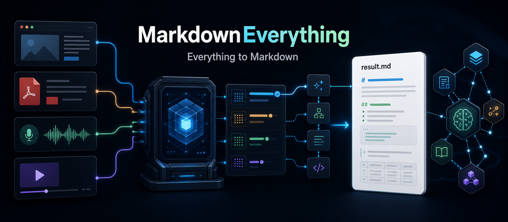
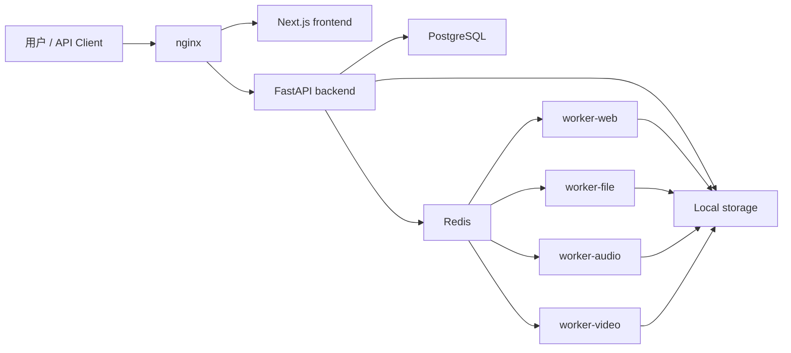

# MarkdownEverything

<p align="center">
  <a href="README.md">English</a> | 简体中文
</p>

<p align="center">
  
</p>

<p align="center">
  <strong>把网页、文档、文本、音频和视频转成干净、结构化、方便人和 AI 使用的 Markdown。</strong>
</p>

<p align="center">
  <a href="#快速开始">快速开始</a>
  · <a href="#支持的内容类型">内容类型</a>
  · <a href="#网页转换引擎">网页引擎</a>
  · <a href="#api">API</a>
  · <a href="#路线图">路线图</a>
</p>

<p align="center">
  
  
  
  
  
</p>

MarkdownEverything 是一个开源的内容入口层。它不只是做格式转换，而是把网页、文件、录音和视频里的内容抓取下来，清洗、结构化、归档，再输出成统一的 Markdown。这样人可以直接读，AI 摘要、RAG 检索、Agent 调用、知识库归档和后续 MCP 集成也都有稳定输入。

## 为什么做

真实世界的内容很少是干净的。网页有导航、广告、登录框和脚本渲染；PDF 的文本结构经常不稳定；DOCX 里混着图片和表格；音视频要先转写，还要保留时间戳；论坛、文档站、视频站和搜索页又各有自己的页面形态。

MarkdownEverything 要做的是把这些输入整理成一套可预测的归档格式：

- 带来源信息的 frontmatter
- 清洗后的 Markdown 正文
- 下载并整理的图片资源
- 音频和视频的时间戳转写
- 可下载的 `.md` 和 `.zip`
- 可调试的任务元数据

## 支持的内容类型

| 输入 | 状态 | 说明 |
| --- | --- | --- |
| 网页 URL | 已支持 | SSRF 安全抓取、通用正文抽取、浏览器渲染兜底、首页/搜索页/SPA 快照 |
| 纯文本 | 已支持 | 输出统一 Markdown |
| HTML | 已支持 | HTML 清洗并转 Markdown |
| CSV | 已支持 | 转为 Markdown 表格 |
| PDF | 已支持 | 以文本提取为主 |
| DOCX | 已支持 | 保留标题、段落、表格，导出图片 |
| 音频文件 | 已支持 | ASR provider 抽象，生成带时间戳的 Markdown |
| 视频文件 | 已支持 | ffmpeg 提取音频后转写 |
| 公开视频链接 | 已支持 | 使用 yt-dlp 处理可访问的公开视频；不绕过登录、付费墙或 DRM |

## 产品页面

- 首页：URL 输入、文件上传、文本/HTML 输入和支持类型概览
- 任务页：状态、进度、输入类型、错误信息、重试入口和结果跳转
- 结果页：Markdown 预览、来源信息、复制、下载 `.md`、下载 `.zip`、删除和重试
- 历史记录：按类型/状态筛选，搜索任务，删除和重新下载结果
- 管理后台：用户、任务、失败日志、Worker 状态、存储占用和系统健康

## 架构



Docker Compose 包含：

- `frontend`：Next.js App Router + TypeScript
- `backend`：FastAPI + SQLAlchemy
- `worker-web`、`worker-file`、`worker-audio`、`worker-video`：按队列拆分的 Celery worker
- `postgres`：用户、任务、日志和元数据
- `redis`：Celery broker/result backend
- `nginx`：统一入口

## 快速开始

```powershell
cp .env.example .env
docker compose up --build
```

打开：

- 应用：<http://localhost>
- API 文档：<http://localhost/api/docs>

如果没有配置 `BOOTSTRAP_ADMIN_EMAIL` 和 `BOOTSTRAP_ADMIN_PASSWORD`，第一个注册用户会自动成为管理员。

本地开发时，如果不想启动 Redis worker，可以启用同步转换：

```powershell
cd backend
$env:SYNC_CONVERSIONS="true"
python -m uvicorn app.main:app --reload
```

## 配置

文本、HTML、CSV、PDF、DOCX 和大多数网页转换不需要 API Key。

音视频转写需要配置一个 ASR provider：

| 模式 | 环境变量 |
| --- | --- |
| 本地 Whisper | `ASR_PROVIDER=local_whisper`，可选 `LOCAL_WHISPER_MODEL=base` |
| OpenAI-compatible ASR | `ASR_PROVIDER=cloud_openai_compatible`，`ASR_API_KEY`，可选 `ASR_BASE_URL`、`ASR_MODEL` |

AI 摘要使用 OpenAI-compatible chat endpoint：

```env
AI_BASE_URL=https://api.openai.com/v1
AI_API_KEY=
AI_MODEL=gpt-4.1-mini
```

如果没有设置 `AI_API_KEY`，转换仍然会成功，摘要会退回到抽取式实现。

## 网页转换引擎

网页转换不是“谁文本最长就选谁”的爬虫脚本，而是一套确定性的候选选择流程。

流程会先分析页面，生成候选内容，再给每个候选计算可解释指标，最后在安全、可读、低噪声的约束下选出 Markdown 结果。

候选来源包括：

- 专用抽取器：Bilibili、GitHub PR、NodeSeek、Wikipedia、Discourse
- 语义容器：`article`、`main`、`[role=main]`、文档站和 prose 容器
- Readability 和 Trafilatura
- JSON-LD 文章结构化数据
- 启发式 DOM 子树
- 首页、搜索页、列表页和 SPA 的渲染快照

每次转换都会留下调试元数据，例如：

```json
{
  "extractor": "trafilatura",
  "extractor_score": 378.32,
  "quality_status": "strong",
  "candidate_count": 5,
  "rendered": false,
  "winner_source": "trafilatura"
}
```

抽取器接口和贡献方式见 [docs/web-extractors.md](docs/web-extractors.md)。

## Benchmark

仓库里带了一套 100+ 网站兼容性测试集：

```powershell
cd backend
$env:PYTHONIOENCODING="utf-8"
python benchmarks\run_web_compat.py --limit 10 --timeout 35 --concurrency 2
```

完整跑一遍：

```powershell
python benchmarks\run_web_compat.py --timeout 45 --concurrency 4 --retry-failed --retry-timeout 60 --retry-concurrency 1
```

报告会写到 `backend/benchmarks/results/`，该目录默认不进入 git。

## API

基础路径：`/api`

| 方法 | 路径 | 用途 |
| --- | --- | --- |
| `POST` | `/jobs` | 创建转换任务 |
| `GET` | `/jobs` | 获取当前登录用户的任务列表 |
| `GET` | `/jobs/{id}` | 获取任务状态和元数据 |
| `GET` | `/jobs/{id}/markdown` | 读取 Markdown 结果 |
| `GET` | `/jobs/{id}/download?format=md` | 下载 Markdown |
| `GET` | `/jobs/{id}/download?format=zip` | 下载结果压缩包 |
| `POST` | `/jobs/{id}/retry` | 重试已完成任务 |
| `DELETE` | `/jobs/{id}` | 软删除任务并清理文件 |

游客任务会返回 `guest_token`。登录用户只能访问自己的历史记录。管理员可以在后台查看全局任务和系统状态。

## 存储结构

MVP 阶段使用本地磁盘存储：

```text
/data/markdown-everything/
  jobs/
    {job_id}/
      input/
      output/
      assets/
      logs/
```

默认保留策略：

- 游客任务：24 小时
- 登录用户任务：7 天
- 原始输入文件可以早于结果清理

## 安全边界

MarkdownEverything 只处理公开内容，或用户有权处理的内容。它不会绕过访问控制。

目前已经实现的安全措施包括：

- 上传扩展名和 MIME 校验
- 上传大小限制
- 网页和图片抓取 SSRF 防护
- 阻止内网、保留地址和本地地址
- 重定向、超时、响应大小和渲染限制
- 单用户和游客并发限制
- 下载鉴权
- 用户任务隔离
- 任务级日志和面向用户的错误信息
- 定期清理过期文件

## 开发

后端测试：

```powershell
cd backend
python -m pytest -q
```

前端开发：

```powershell
cd frontend
npm install
npm run dev
```

常用路径：

- `backend/app/converters/web.py`：网页转换编排
- `backend/app/converters/web_engine/`：确定性通用网页引擎
- `backend/app/converters/web_extractors/`：站点/页面专用抽取器
- `backend/app/tasks.py`：Celery 转换任务流程
- `frontend/app/`：Next.js 页面
- `docs/web-extractors.md`：抽取器贡献指南

## 路线图

MVP 之后计划补上：

- 批量转换
- OCR 和扫描 PDF
- 自动标签和标题增强
- Obsidian 导出
- Git 仓库导出
- API Key
- Webhook
- MCP Server
- RAG 分块导出
- Markdown 模板
- 多文件合并和总结

## License

暂未声明许可证。正式对外使用前，建议先补上开源许可证。
